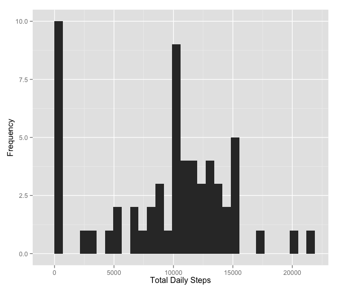

# Reproducible Research: Peer Assessment 1

## Loading and preprocessing the data

**Preliminary work.**

Load in package dependencies.

```r
library(plyr)
library(dplyr)
```

```
## 
## Attaching package: 'dplyr'
## 
## The following objects are masked from 'package:plyr':
## 
##     arrange, count, desc, failwith, id, mutate, rename, summarise,
##     summarize
## 
## The following objects are masked from 'package:stats':
## 
##     filter, lag
## 
## The following objects are masked from 'package:base':
## 
##     intersect, setdiff, setequal, union
```

```r
library(ggplot2)
```

Unzip the "activity.zip" file and save "activity.csv"" to a separate data folder in the working directory if the file/directory doesn't already exist.


```r
if (!file.exists("./data")) {
    dir.create("./data")
}
if (!file.exists("./data/activity.csv")) {
    unzip("activity.zip", files="activity.csv", exdir="./data")
}
```

Read in the data.

```r
activity <- read.csv("./data/activity.csv", header = TRUE, colClasses=c("numeric", "character", "numeric"))
dim(activity)
```

```
## [1] 17568     3
```

Activity data summary:

```r
summary(activity)
```

```
##      steps            date              interval     
##  Min.   :  0.00   Length:17568       Min.   :   0.0  
##  1st Qu.:  0.00   Class :character   1st Qu.: 588.8  
##  Median :  0.00   Mode  :character   Median :1177.5  
##  Mean   : 37.38                      Mean   :1177.5  
##  3rd Qu.: 12.00                      3rd Qu.:1766.2  
##  Max.   :806.00                      Max.   :2355.0  
##  NA's   :2304
```

Convert the date column values from character to Date:

```r
activity$date <- as.Date(activity$date, format="%Y-%m-%d")
```
## What is mean total number of steps taken per day?
Calculate the total number of steps taken per day, ignoring the missing values in the dataset.


```r
## dailysteps <- select(rowsum(activity, activity$date, na.rm = FALSE), steps)  
dailySteps <- tapply(activity$steps, activity$date, sum, na.rm=TRUE)
```

**Make a histogram of the total number of steps taken each day.**


```r
## hist(dailysteps$steps, xlab = "Number of Steps", labels = TRUE, main="Histogram of Daily Steps")
qplot(dailySteps, xlab = "Total Daily Steps", ylab = "Frequency")
```

```
## stat_bin: binwidth defaulted to range/30. Use 'binwidth = x' to adjust this.
```

 

**Calculate and report the mean and median of the total number of steps taken per day**


Mean: 


```r
mean(dailySteps)
```

```
## [1] 9354.23
```

Media: 


```r
median(dailySteps)
```

```
## [1] 10395
```

- The daily steps **mean** is 9354.2295082.

- The daily steps **median** is 1.0395\times 10^{4}.

## What is the average daily activity pattern?


## Imputing missing values


## Are there differences in activity patterns between weekdays and weekends?
