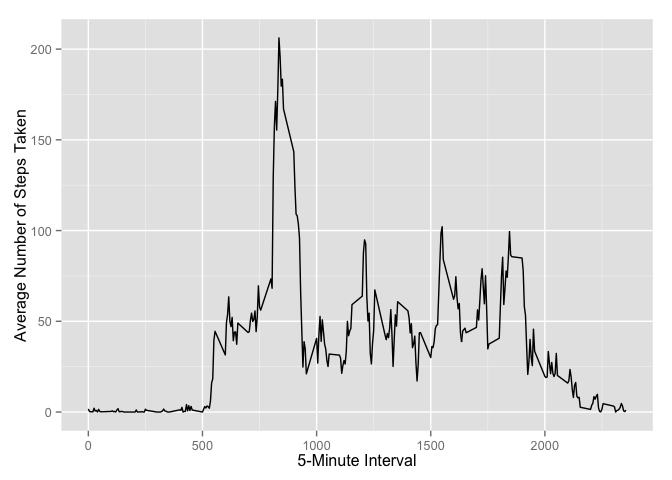
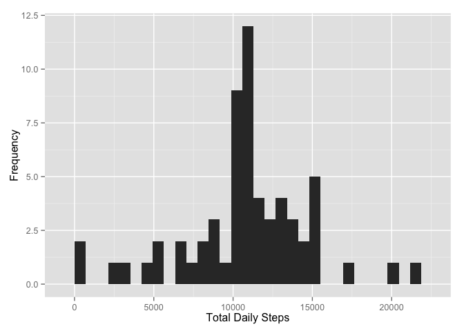
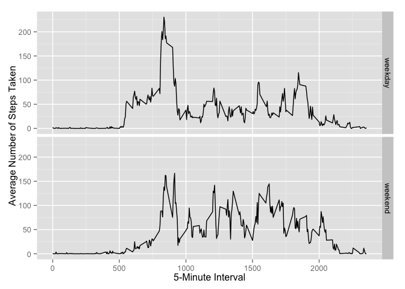

# Reproducible Research: Peer Assessment 1

## Loading and preprocessing the data

**Preliminary work.**

Load in package dependencies.

```r
library(plyr)
library(dplyr)
```

```
## 
## Attaching package: 'dplyr'
## 
## The following objects are masked from 'package:plyr':
## 
##     arrange, count, desc, failwith, id, mutate, rename, summarise,
##     summarize
## 
## The following objects are masked from 'package:stats':
## 
##     filter, lag
## 
## The following objects are masked from 'package:base':
## 
##     intersect, setdiff, setequal, union
```

```r
library(ggplot2)
```

Unzip the "activity.zip" file and save "activity.csv"" to a separate data folder in the working directory if the file/directory doesn't already exist.


```r
if (!file.exists("./data")) {
    dir.create("./data")
}
if (!file.exists("./data/activity.csv")) {
    unzip("activity.zip", files="activity.csv", exdir="./data")
}
```

Read in the data.

```r
activity <- read.csv("./data/activity.csv", header = TRUE, colClasses=c("numeric", "character", "numeric"))
dim(activity)
```

```
## [1] 17568     3
```

Activity data summary:

```r
summary(activity)
```

```
##      steps            date              interval     
##  Min.   :  0.00   Length:17568       Min.   :   0.0  
##  1st Qu.:  0.00   Class :character   1st Qu.: 588.8  
##  Median :  0.00   Mode  :character   Median :1177.5  
##  Mean   : 37.38                      Mean   :1177.5  
##  3rd Qu.: 12.00                      3rd Qu.:1766.2  
##  Max.   :806.00                      Max.   :2355.0  
##  NA's   :2304
```

Convert the date column values from character to Date:

```r
activity$date <- as.Date(activity$date, format="%Y-%m-%d")
```
## What is mean total number of steps taken per day?

**1. Calculate the total number of steps taken per day, ignoring the missing values in the dataset.**


```r
## dailysteps <- select(rowsum(activity, activity$date, na.rm = FALSE), steps)  
dailySteps <- tapply(activity$steps, activity$date, sum, na.rm=TRUE)
```

**2. Make a histogram of the total number of steps taken each day.**


```r
## hist(dailysteps$steps, xlab = "Number of Steps", labels = TRUE, main="Histogram of Daily Steps")
qplot(dailySteps, xlab = "Total Daily Steps", ylab = "Frequency")
```

```
## stat_bin: binwidth defaulted to range/30. Use 'binwidth = x' to adjust this.
```

 

**3. Calculate and report the mean and median of the total number of steps taken per day**


Mean: 


```r
mean(dailySteps)
```

```
## [1] 9354.23
```

Median: 


```r
median(dailySteps)
```

```
## [1] 10395
```

- The daily steps **mean** is 9354.2295082.

- The daily steps **median** is 1.0395\times 10^{4}.

## What is the average daily activity pattern?

**1. Make a time series plot of the 5-minute interval (x-axis) and the average number of steps taken, averaged across all days (y-axis)**

```r
avgIntervalSteps <- aggregate(
                        list(stepsMean=activity$steps),
                        by = list(interval=activity$interval),
                        FUN = mean, 
                        na.rm = TRUE
                    )
```

Make a time series plot


```r
ggplot(avgIntervalSteps, aes(x=interval, y=stepsMean)) + 
    geom_line() + 
    xlab("5-Minute Interval") + 
    ylab("Average Number of Steps Taken")
```

 

Which 5-minute interval, on average across all the days in the dataset, contains the maximum number of steps?


```r
mostActiveInterval <- avgIntervalSteps[which.max(avgIntervalSteps$steps), c("interval")]

mostActiveInterval
```

```
## [1] 835
```

**Answer:** On average, the most active 5-minute interval is **835**.

## Imputing missing values

**1. Calculate and report the total number of missing values in the dataset (i.e. the total number of rows with NAs)**


```r
numMissing <- nrow(activity[is.na(activity$steps),])
numMissing
```

```
## [1] 2304
```

**Answer:** The total number of missing steps is **2304**.

**2. Devise a strategy for filling in all of the missing values in the dataset. The strategy does not need to be sophisticated. For example, you could use the mean/median for that day, or the mean for that 5-minute interval, etc.**


```r
## Replace missing values with the mean for that 5-minute interval.

modActivity <- merge(activity, avgIntervalSteps, by = "interval", all.x = TRUE)
```

**3. Create a new dataset that is equal to the original dataset but with the missing data filled in.**


```r
## Replace missing date with the 5-min interval, remove the extra data and sort by date, interval.

modActivity[is.na(modActivity$steps), c("steps")] <- modActivity[is.na(modActivity$steps), c("stepsMean")]
modActivity <- select(modActivity, steps, date, interval)
modActivity <- arrange(modActivity, date, interval)
modActivity$date <- as.Date(modActivity$date)

head(modActivity)
```

```
##       steps       date interval
## 1 1.7169811 2012-10-01        0
## 2 0.3396226 2012-10-01        5
## 3 0.1320755 2012-10-01       10
## 4 0.1509434 2012-10-01       15
## 5 0.0754717 2012-10-01       20
## 6 2.0943396 2012-10-01       25
```

**4. Make a histogram of the total number of steps taken each day and Calculate and report the mean and median total number of steps taken per day.**

Mean and median daily steps are the same after replacing the NAs with the interval means.


```r
modDailySteps <- tapply(modActivity$steps, modActivity$date, sum)
qplot(modDailySteps, xlab = "Total Daily Steps", ylab = "Frequency")
```

```
## stat_bin: binwidth defaulted to range/30. Use 'binwidth = x' to adjust this.
```

 


Mean: 


```r
mean(modDailySteps)
```

```
## [1] 10766.19
```

Median: 


```r
median(modDailySteps)
```

```
## [1] 10766.19
```

What is the impact of imputing missing data on the estimates of the total daily number of steps?
**Answer:** The results show a more natural bell curve over the day; the spike at interval 0 is gone.

Do these values differ from the estimates from the first part of the assignment?

**Answer:** Mean and Median are higher than the values in the first part of the assignment. Unlike the first part of the assignment, the mean and median values are now equal.

- The daily steps **mean** is 1.0766189\times 10^{4}.

- The daily steps **median** is 1.0766189\times 10^{4}.

## Are there differences in activity patterns between weekdays and weekends?

**Answer:** Yes, the activity patterns differ between weekdays and weekends.

**1. Create a new factor variable in the dataset with two levels – “weekday” and “weekend” indicating whether a given date is a weekday or weekend day.**


```r
modActivity$daytype <- as.factor(ifelse ( weekdays(modActivity$date) %in% c("Saturday","Sunday"), "weekend", "weekday" ) )
```


**2. Make a panel plot containing a time series plot of the 5-minute interval (x-axis) and the average number of steps taken, averaged across all weekday days or weekend days (y-axis).**


```r
avgModActivity <- aggregate(
                    steps ~ interval + daytype,
                    data = modActivity,
                    FUN = mean
                  )

ggplot(avgModActivity, aes(interval, steps)) + 
    geom_line() + 
    facet_grid(daytype ~ .) + 
    xlab("5-Minute Interval") + 
    ylab("Average Number of Steps Taken")
```

 
